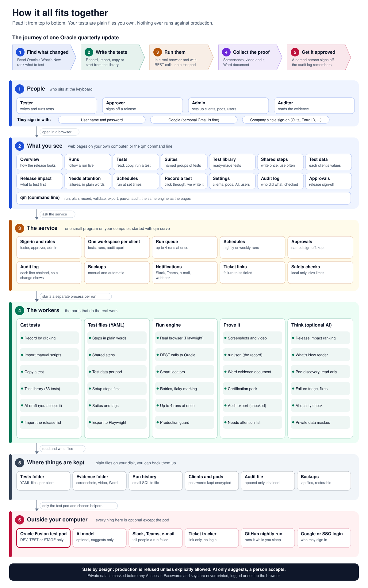
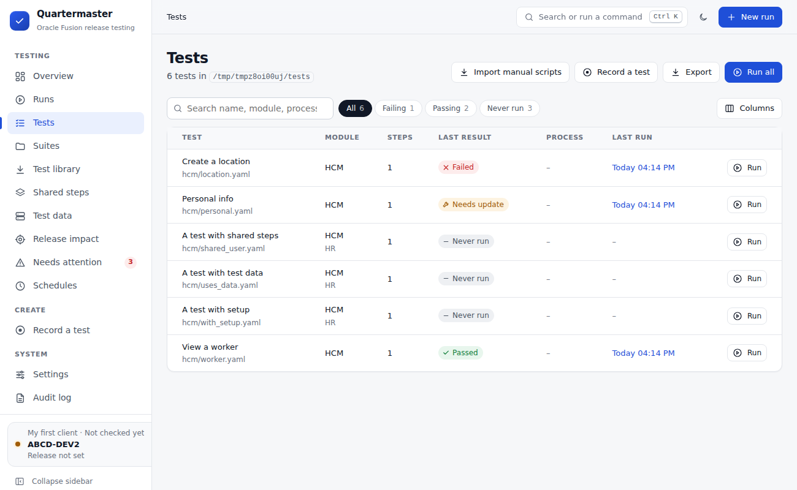
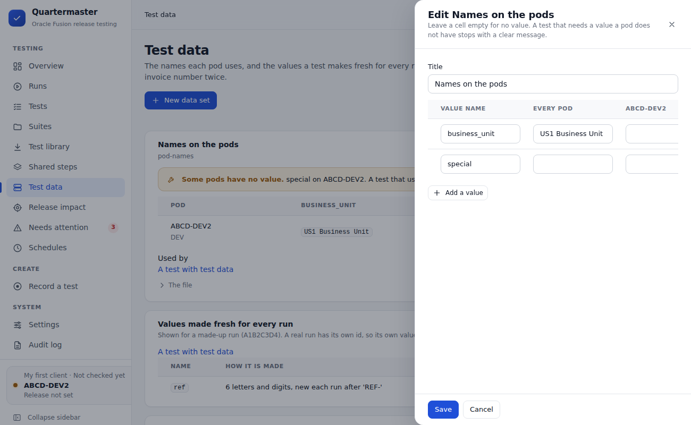
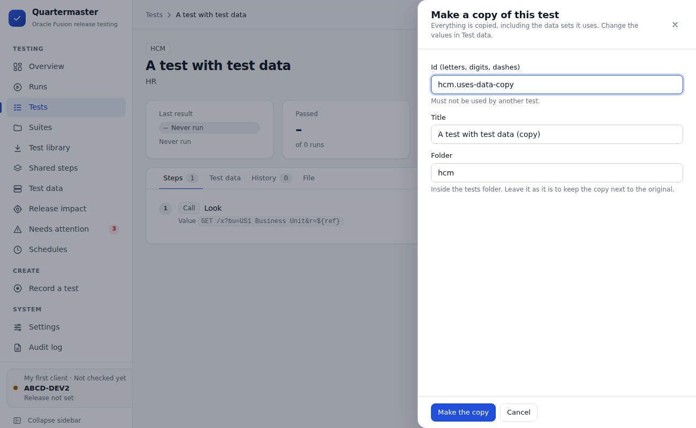
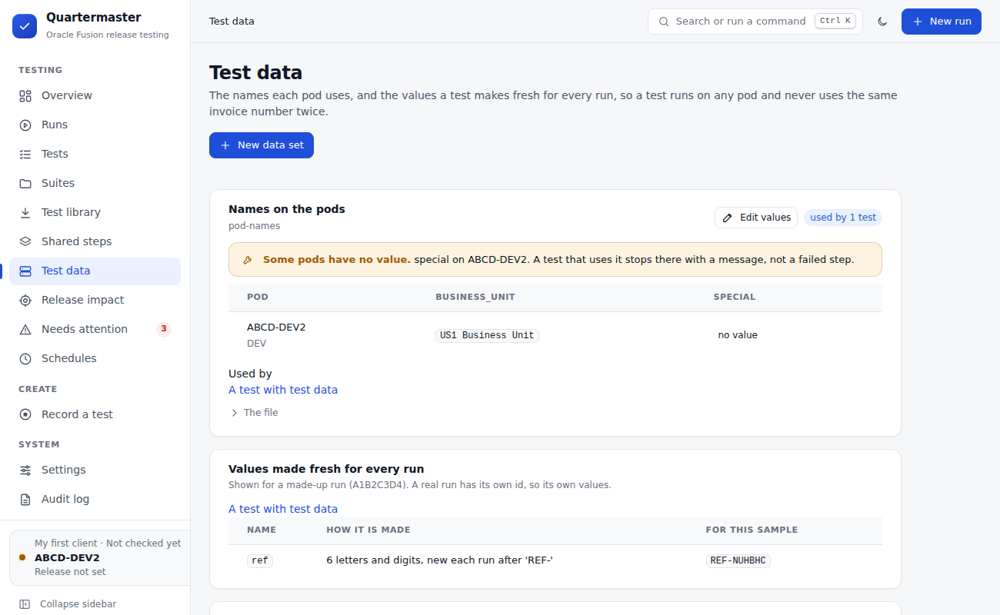
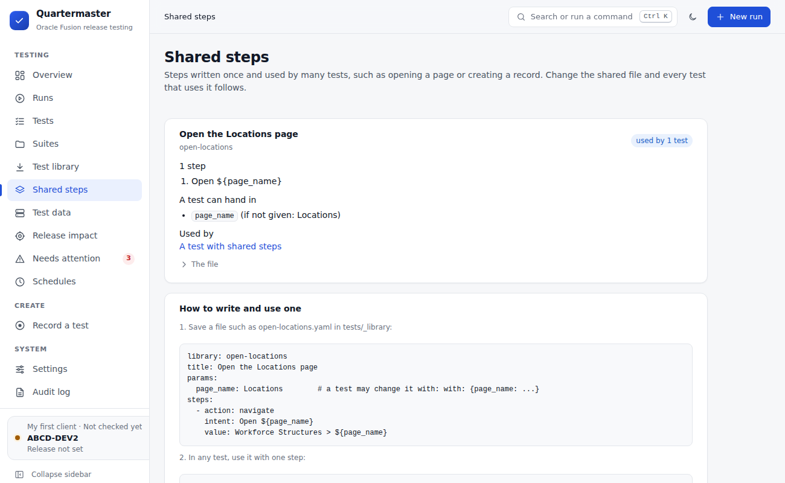
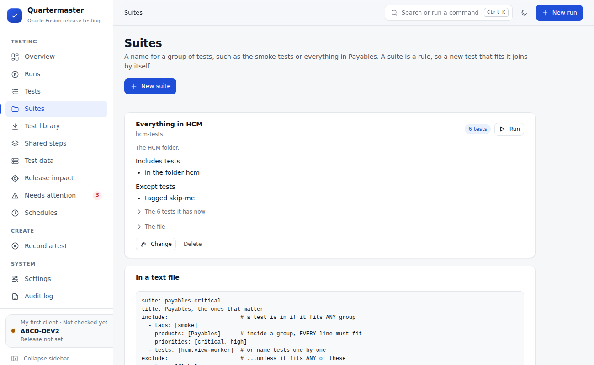
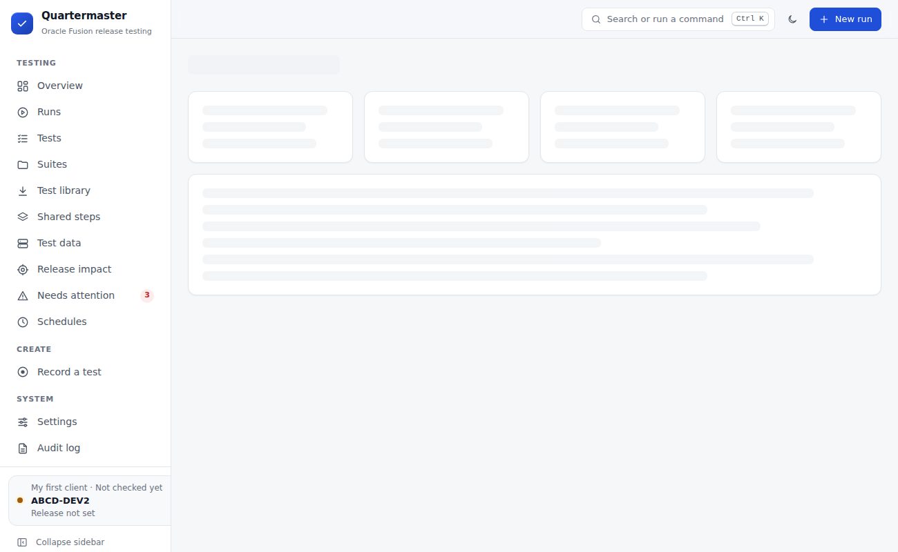
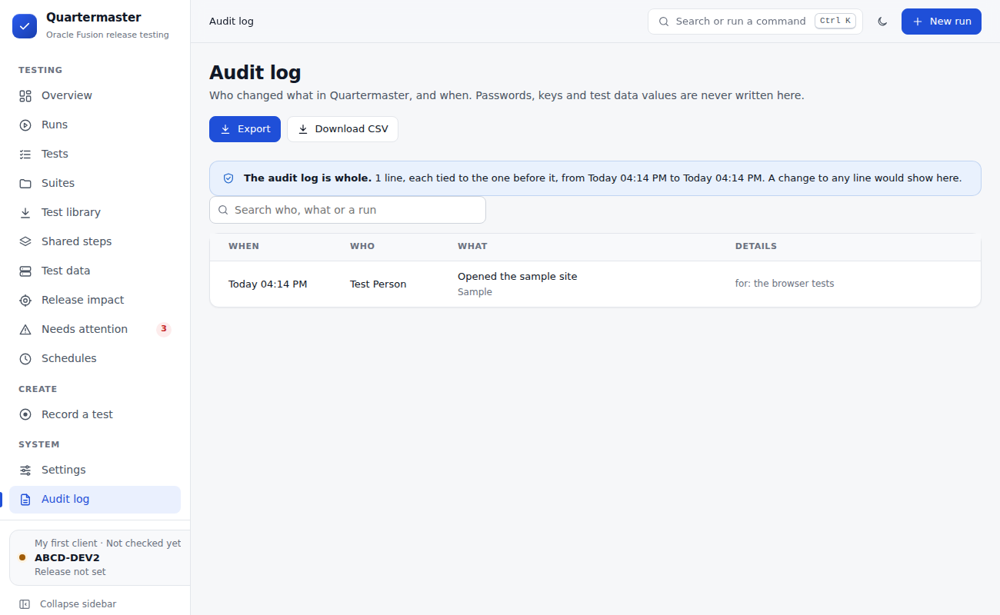

# Quartermaster

Quartermaster tests your Oracle Fusion Cloud pod before each quarterly update reaches production, and gives you proof of what passed.

You write a test once, in a plain text file. Quartermaster runs it in a real browser (or calls Oracle's REST services), takes screenshots, and writes a Word document an auditor can read. It runs on your own computer, so there is no per-seat licence, and your tests are files you keep.

AI is optional and only ever suggests. A person accepts every change. Nothing runs against a production pod.

**Want to try it?** Follow [TESTING.md](TESTING.md), step by step. The original plan is in [docs/PLAN.md](docs/PLAN.md). How we compare with other tools is in [docs/COMPETITORS.md](docs/COMPETITORS.md).

## How it all fits together



Read it from top to bottom.

1. **People** sign in and use the pages in a browser.
2. **The pages** (and the `qm` command line) ask the service to do things.
3. **The service** is one small program on your computer (`qm serve`). It handles sign-in, one workspace per client, the run queue, schedules, approvals, the audit log, backups and notifications.
4. **The workers** do the real work: get or write tests, run them in a browser, collect proof, and (if you allow it) think with AI.
5. **Files on your disk** hold everything. Your tests are plain YAML files.
6. **Outside your computer** are only the test pod and the helpers you choose to switch on.

## Contents

- [Start it](#start-it)
- [Words used in this project](#words-used-in-this-project)
- [Write a test](#write-a-test)
- [Each client has its own values](#each-client-has-its-own-values)
- [Reuse tests](#reuse-tests): shared steps, suites, the test library, export
- [Plan a release](#plan-a-release)
- [The pages](#the-pages)
- [People, sign-in and approval](#people-sign-in-and-approval)
- [Proof of testing](#proof-of-testing)
- [Automation](#automation): parallel runs, schedules, nightly run, notifications, tickets, backups
- [AI (optional)](#ai-optional)
- [For developers](#for-developers)
- [Settings reference](#settings-reference)

## Start it

**Windows, no terminal.** Double-click **Start Quartermaster** in this folder. The first time, it installs what it needs and puts a **Quartermaster** icon on your desktop. After that, use the icon. Your browser opens Quartermaster, and a setup guide asks for the client, its pod and a test user. **Update Quartermaster** gets the latest version.

**Mac or Linux.** Run `./start-quartermaster.sh`.

**From a terminal.** You need Python 3.11 or newer and Git.

```bash
git clone https://github.com/pvsairam/TaaS.git && cd TaaS
python -m venv .venv
# Windows: .venv\Scripts\activate      Mac or Linux: source .venv/bin/activate
pip install -e ".[browser]"
python -m playwright install chromium
qm serve
```

Your browser opens `http://127.0.0.1:8765`. Keep the terminal open while you use it. Press Ctrl+C to stop.

The service only answers on this computer, and it refuses requests from other web sites, so no web page can start a run behind your back.

**Connect to your pod.** The easiest way is the setup guide in the browser. From a terminal, set the details for that terminal only, and never save them in the repository:

```bash
# Windows PowerShell                                        # Mac or Linux
$env:QM_FUSION_URL="https://<pod>.fa.us6.oraclecloud.com"   # export QM_FUSION_URL=...
$env:QM_FUSION_USER="<user>"                                # export QM_FUSION_USER=...
$env:QM_FUSION_PASSWORD="<password>"                        # export QM_FUSION_PASSWORD=...
```

Then check you can sign in, and run a first test:

```bash
qm run examples/smoke/login.yaml --headed
qm run examples/tests/hcm/view_worker.yaml --headed
```

Use a test user made for testing. Never use a real employee's account. Quartermaster refuses a pod that looks like production.



## Words used in this project

| Word | Meaning |
|---|---|
| **Client** | One customer. Each client has its own tests, evidence, runs, schedules and audit log. |
| **Pod** (or environment) | One Oracle Fusion system of a client, such as DEV2 or STAGE. Test pods only. |
| **Test** | One YAML file: a list of steps and what should be true at the end. |
| **Step** | One action (open a page, click, type, check a value, call a REST service). |
| **Suite** | A saved rule that picks tests, such as "all critical Payables tests". |
| **Data set** | A small file with the names a pod uses (business unit, ledger), so tests do not hold them. |
| **Evidence** | What a run leaves behind: screenshots, video, `run.json`, and a Word document. |
| **Release** | An Oracle quarterly update, such as 26C or 26D. |

## Write a test

```yaml
id: ap.create-invoice-po-match
title: Create and validate a PO-matched supplier invoice
module: Financials
product: Payables
priority: critical
data:
  invoice_number: QM-INV-${RUN_ID}   # RUN_ID is different on every run
steps:
  - action: navigate
    intent: Open Invoices work area
    value: Payables > Invoices
  - action: fill
    intent: Enter invoice number
    value: ${invoice_number}
    target:
      strategies:            # tried in order; the first that finds exactly one item wins
        - label: Number
        - label: Invoice Number
```

`examples/tests/` has tests that were checked on a real pod and are safe to repeat (they never submit anything). `examples/unverified/` has bigger HCM and ERP examples. They have not been checked on a pod and they do submit real transactions, so they are kept out of the tests folder. The absence example shows an employee sending a request and then switching to the line manager (`login_as`) to approve it.

You do not have to write the file by hand. You can also:

- **Record it.** Open **Record a test**, name the test and start. A browser opens already signed in. Click through the flow. Press **Add check** and click a value to record what should be true. Press **Stop recording**.
- **Import it.** Bring in manual Excel test scripts on the **Tests** page.
- **Copy it.** Open a test and press **Make a copy**.
- **Start from the library.** See [the test library](#the-test-library).

From a terminal, `qm record my_tests/view_worker.yaml --id hcm.view-worker --title "View a worker" --module HCM --product "Global Human Resources"` does the same as the page, then `qm run my_tests/view_worker.yaml --headed` plays it back.

What recording saves:

| You do | Saved as |
|---|---|
| Open a page from the Navigator | one step: `navigate: My Client Groups > Workforce Structures` |
| Click a button, link or tile | `click` |
| Type in a field, or a Redwood date | `fill` (dates as `01/01/1951`) |
| Type in a list and click a suggestion | `select`, with the exact suggestion kept as `pick` |
| Add check, then click a value | `assert_text` (or `assert_visible` for long text) |

Good to know about recording:

- Typed values go into the file's `data` block (`value1`, `value2`, and so on). Rename them to something meaningful, then you can change data without touching steps.
- Sign-in and password fields are never recorded. Oracle's generated ids are never used to find items, because they change.
- When a label appears twice on a page, the step is anchored to the heading above it.
- Press **Mask value** right after typing something private. It is hidden in the step list and never written to the file, the run record or the documents. The test reads it from an environment variable the recorder names when it saves (for example `QM_HCM_VIEW_WORKER_1`). Set it like the password before running.
- Add at least one check at the end of every flow, so a replay proves the outcome and not only the clicks.
- Keep recorded tests in one folder under version control (for example `my_tests/`), and re-run it after each update: `qm run my_tests --evidence-doc`. Only keep tests there that are safe to repeat.

### Steps that call a REST service

A step can call a Fusion REST service, for example to check that a record made on screen is really saved. It uses the browser's signed-in session, so no extra password is needed, and it only ever calls the pod itself.

```yaml
  - action: api_call
    intent: The new location is saved
    value: GET /hcmRestApi/resources/11.13.18.05/locationsV2?q=LocationName='${location_name}'
    options:
      expect_status: 200            # optional; any 2xx when left out
      check:                        # optional; a path in the reply and the value it must have
        count: 1
        items[0].ActiveStatus: A
        items[0].LocationId: "*"    # "*" means: it is there and not empty
      save:                         # optional; later steps can use ${location_id}
        location_id: items[0].LocationId
```

`value` is `METHOD /path` (GET, POST, PATCH, PUT or DELETE). For POST, PATCH and PUT, put the JSON to send under `options.body`. `${name}` works inside it. A REST step that changes data changes it on the pod, like a click on Save would.

### When a step fails

- **Retries.** A slow page is not a changed page, so a failed step is tried again after a short wait. You choose in Settings, Evidence, **If a step fails**: stop at once, once more, or twice more (`qm run --retries 0-3`). Only safe steps are repeated: a click only when its item was not found (so it was never clicked), a REST call only when it reads (GET), and never a wait for a scheduled process. A step can set its own with `options: {retries: 0}`. The run, the Word document and `run.json` say which step needed more than one try.
- **Flaky tests.** A test that passes only after a retry is marked **Flaky** once that has happened in 2 of its last 10 runs. Overview shows **Stability**: the share of runs in the last 30 days that needed a retry (the aim is under 2%).
- **Suggested fixes.** When a button, link or field is not on the screen any more, Quartermaster looks at the page while it is still open. First it looks for a name very like the old one ("Search by Name" for "Search: Name"), with no AI. Then, if you set up an AI and the box *Suggest a fix when a step cannot find its item* is on, it shows the AI the step and the names on the screen (personal details hidden first). A suggestion is checked (it must be found exactly once, and a Save or Delete button is never suggested unless the step is about it). It is **only a suggestion**: the step still fails and nothing changes. It shows on the failure in **Needs attention**. **Use the suggestion** adds it as the first way to find the item and keeps the old ways below it. A copy of the old file is kept. Run the test again to check it.

### Cleaning up after a test

A test that creates something on the pod can remove it at the end. Put the removal steps under `cleanup:`. They run after the steps, whether the steps passed or failed.

```yaml
steps:
  - action: api_call
    intent: Create the location
    value: POST /hcmRestApi/resources/11.13.18.05/locationsV2
    options:
      body: {LocationName: "QM Test ${RUN_ID}"}
      save: {location_id: LocationId}       # keep the id of what was made
cleanup:
  - action: api_call
    intent: Remove the location
    value: DELETE /hcmRestApi/resources/11.13.18.05/locationsV2/${location_id}
```

- A cleanup that fails is shown on the run, in the Word document ("Cleanup did not finish: records from this test may still be on the pod") and in **Needs attention**, even when the test passed. It never changes the test's result, and the other cleanup steps still run.
- If the test failed before it made the record, `${location_id}` was never saved. The step is then skipped ("Nothing to clean up").
- A cleanup `DELETE` must use a saved value such as `${location_id}`. A fixed address is refused when the test loads, so a cleanup can only remove what this run made.
- Any step can be a cleanup step. Add `options: {needs: location_id}` to skip a step when that saved value is missing.

## Each client has its own values

Every client has its own business unit, ledger and supplier names. A test should not have them typed in. The test says `${business_unit}`, and a **data set** says what that is on each pod.

1. The test names a value, `${business_unit}`, and says which data set to use: `data_sets: [hcm-basics]`.
2. The data set is a file in the client's `_data` folder. It holds one value for every pod, and a different value for any pod that differs.
3. Every client has its own tests folder, so it has its own `_data` folder. To use a test for a new client, copy it and fill in that client's data set. The steps do not change.

You do not need a text editor. On the **Test data** page, press **New data set** or **Edit values**, and fill in the table: one row per name, one column for every pod. Leave a cell empty for "no value". The old file is kept as a backup.



To copy a test, open it and press **Make a copy**. Give the copy its own id and title. Steps, comments and the data sets it uses are kept. Then change the values in Test data for the client the copy is for.



The same data set as a file (`my_tests/_data/hcm-basics.yaml`):

```yaml
dataset: hcm-basics
title: Names on the pods
values:                          # used on every pod unless a pod below says otherwise
  business_unit: US1 Business Unit
pods:                            # by the environment's name in Settings, or by its kind (DEV, TEST, STAGE)
  DEV2: {business_unit: Vision Operations}
  STAGE: {business_unit: US1 Stage BU}
```

A test uses it with `data_sets: [hcm-basics]`. A test can also have its own `pods:` block. The order is: the data set's values, then its pod values, then the test's own `data:`, then the test's own `pods:`. The last one wins. A pod is matched by its name first, then by its kind, ignoring capital letters.



**If a pod has no value.** The test stops at step 1 with "No test data for X on DEV2 (DEV)". Nothing is sent to the pod. **Needs attention** shows it as "Test data not ready", so a gap in the data is never mistaken for a broken release.

**Values made fresh for every run.** A test that creates an invoice must not use the same number twice. Add a `generate:` block:

```yaml
generate:
  invoice_no: {unique: 6, prefix: "INV-"}                      # INV-7K2Q9X, new each run
  start_date: {date: today, plus_days: 30, format: "%Y-%m-%d"} # 30 days from today
  amount: {number: [100, 999]}                                 # a whole number in that range
  currency: {choice: [USD, EUR, GBP]}                          # one of these
```

Use them as `${invoice_no}`, like any data. The values come from the run's own id, so they stay the same all through one run, and the evidence shows exactly what was typed. A generated name may not clash with a name in `data`, and a `data` value may use a generated one (`code: "C-${invoice_no}"`).

Other facts:

- The Test data page also shows, for every data set, which tests use it, a warning for a set that does not exist or a file that cannot be read, and the values each test makes fresh (shown for a made-up run).
- The service tells each run which pod it is for (`QM_ENV_NAME`). In a terminal, `qm run --env-name DEV2 --kind DEV` does the same.
- Never write a password in a data set. Use `${env:NAME}` for anything secret.
- The `_data` folder is not for tests. Test lists, runs and impact analysis skip it. Backups include it. Exported Playwright tests keep all of this.

### Setup steps: check or make what the test needs first

Some tests only make sense when the pod is ready: the accounting period is open, a supplier exists. Add a `setup:` list. Its calls run first, after sign-in and before the steps.

```yaml
setup:
  - action: api_call
    intent: The accounting period is open
    value: GET /fscmRestApi/resources/11.13.18.05/periods?q=Status=Open
    options:
      check: {count: "1"}                 # the reply must say so
  - action: api_call
    intent: Make a supplier for this run
    value: POST /fscmRestApi/resources/11.13.18.05/suppliers
    options:
      body: {Supplier: "QM-${ref}"}       # ${ref} is made fresh for this run (see generate:)
      save: {supplier_id: SupplierId}     # kept for the steps and the cleanup
```

- Only service calls (`api_call`) can be setup. They take the same options as a service step: `body`, `check`, `save`.
- **If a setup call fails, the steps never run.** The test stops at step 1 with "Setup not met: ...". The rest of the setup is marked not run. The cleanup still runs, so a supplier made by an earlier setup call is removed. Needs attention shows it as **Test data not ready**, with no "probably the update" advice, because the pod was not ready and no release broke the test.
- A call that only reads (GET) is tried again like any step. A call that writes is never repeated, because a second POST could make a second record.
- A setup `DELETE` must use a saved value, like a cleanup `DELETE`.
- Names used in setup must be defined: in `data`, in a data set, in `generate:`, or saved by an earlier setup call.
- The run page says "The pod was ready", with what was checked. The Word document has a **Setup before the test** table, so the record shows the pod was ready.

## Reuse tests

### Shared steps

Steps you use in many tests (open a page, create a record) can be written once. Put a YAML file in the `_library` folder inside your tests folder (`my_tests/_library/open-locations.yaml`):

```yaml
library: open-locations          # the name tests use
title: Open the Locations page
params:                          # optional: what a test may change (no value = the test must give it)
  page_name: Locations
steps:
  - action: navigate
    intent: Open ${page_name}
    value: Workforce Structures > ${page_name}
cleanup:                         # optional: added to the cleanup of every test that uses it
  - ...
```

A test uses it with one step, and may hand in values:

```yaml
steps:
  - use: open-locations
    with: {page_name: Locations}
```

- When a test loads, that step is replaced by the group's steps, so the runner, the evidence and the fixing see ordinary steps.
- `${param}` in a group is what the test handed in (or the default). Any other `${name}` is test data, and the test needs it in its `data`.
- A group cannot use another group. The `_library` folder is not for tests.
- The **Shared steps** page lists every group, what it takes, which tests use it, and warns about a test that uses a group that does not exist. A test's **Steps** tab marks the steps that come from a group.
- A suggested fix or an accepted Oracle screen change for a shared step is written to the shared file, so every test that uses it follows. Backups include `_library`.



### Suites

Tests belong to your client, not to a release or a project, so you do not copy them for each release. A **suite** is a saved rule that picks tests, such as "the smoke tests" or "everything in Payables that is critical". Because it is a rule, a new test that fits it joins by itself.

A suite is one YAML file in the `_suites` folder (or made with **Suites, New suite**, which writes the same file):

```yaml
suite: payables-critical
title: Payables, the ones that matter
description: What we run first after every update.
include:                          # a test is in if it fits ANY of these groups
  - tags: [smoke]
  - products: [Payables]          # inside a group, EVERY line must fit
    priorities: [critical, high]
  - tests: [hcm.view-worker]      # or name tests one by one
exclude:                          # ...unless it fits ANY of these
  - tags: [flaky]
```

- A line is `tags`, `folders`, `modules`, `products`, `priorities` or `tests` (ids). It fits when the test has **any** of its values. Capital letters do not matter.
- **Run it** from Suites (Run), from the New run drawer (**A suite**), from a schedule (**What to test**), or in a terminal: `qm run my_tests --suite payables-critical`. `qm suites my_tests --list` shows each suite and its tests.
- A suite with no test right now cannot be run, and says so. A group that matches nothing, or an id no test has, is shown as a warning.
- Suites are plain files, so they are in backups and can be kept in git. The `_suites` folder is not for tests. Testers can make, change and delete suites. The audit log records it.
- The page edits suites written the way it writes them. A suite that uses other leave-out rules still works, but is changed in a text editor. The page says so.



### The test library

**Test library** in the menu has packs of ready-made tests. **Install** copies a pack into `<your tests folder>/library/<pack>/`, where its tests are ordinary tests: run them, schedule them, edit them. A suite for the pack (`library-<pack>`) is made with them, so one click runs them all.

| Pack | Tests | What it asks the pod |
|---|---|---|
| `hcm-services` | 23 | workers, locations, departments, jobs, grades, positions, legal employers, absences, user accounts, salaries, payroll relationships, goals, checklists, recruiting requisitions and more |
| `financials-services` | 13 | payables and receivables invoices, receipts, credit memos, ledgers, account combinations, currencies, payment terms, journals, expense reports, bank accounts, projects, ERP integrations |
| `procurement-services` | 6 | suppliers, purchase orders, requisitions, agreements, procurement agents, negotiations |
| `supply-chain-services` | 12 | items, catalogs, inventory organizations, units of measure, subinventories, shipments, receiving, work orders, production resources, calendars, sales orders |
| `sales-services` | 9 | accounts, contacts, leads, opportunities, activities, resources, products, service requests, households |

What they are: each test asks one Oracle REST service for a single record (`GET ...?limit=1`), checks that the service still answers and still returns the fields integrations rely on (for example `PersonId` and `PersonNumber` for workers), then reads that record again by its id where the service allows it. That is where an update most often breaks something quietly: a renamed or removed field, or a service that stopped answering.

What they are not: they never click through screens, and **nothing is ever created, changed or deleted**. Every step is a `GET`, and each test is checked to be so.

- **Checked on a pod.** Each pack says when it was last run on a pod and how many of its tests passed. That was one test pod, so on yours it can differ: your release may not have a service, your test user may not be allowed to read one (HTTP 403), or a pod with no record of a kind fails the field check. Run a pack once on your pod and read what fails. That is information, not noise.
- **Updating.** Installing again after a new Quartermaster release adds new tests and updates the ones you have not changed. A file you changed is kept as it is.
- **From a terminal:** `qm packs list --tests my_tests`, `qm packs install hcm-services --tests my_tests`, `qm packs install --all`.
- **For people who maintain packs:** `python tools/check_pack.py src/quartermaster/packs/hcm-services --write` runs a pack's tests against the pod in `QM_FUSION_URL`, with plain HTTP and no browser.
- **Not in the library yet:** tests that click through screens, and anything that creates data. They depend on a pod's menus, roles and release, so they cannot be shipped honestly without being run on that pod. Use **Record a test** instead.

### Export as plain Playwright (no lock-in)

Your tests do not have to stay in Quartermaster. **Tests, Export** (all tests), or **Export** on a test's page, downloads a zip. `qm export my_tests --out exported` writes the same files to a folder. Each test becomes a normal Playwright for Python test (run by pytest) that needs **only Playwright and pytest**. You can read it, change it, keep it in your own repository and run it in your own CI.

```
exported/
  test_hcm_create_location.py   one file per test
  fusion_runtime.py             the small library the tests call (plain code)
  conftest.py  pytest.ini  requirements.txt  README.md  .gitignore
```

```bash
cd exported
pip install -r requirements.txt && python -m playwright install chromium
export QM_FUSION_URL=https://abcd-dev2.fa.us6.oraclecloud.com QM_FUSION_USER=... QM_FUSION_PASSWORD=...
pytest -v            # pytest -k create_location, pytest -m smoke, pytest -n 4 (with pytest-xdist)
```

What the export keeps: the same way of finding items (the first way that finds exactly one element wins), the Navigator, Redwood date boxes, type-ahead lists, REST steps with the browser's session, waiting for a scheduled process, personas, the refusal to run on a production-looking pod, `${name}` data, `${RUN_ID}`, and `${env:SECRET}` (a secret stays a reference, so no password is ever written into an exported file). Data sets and `generate:` are kept too, and the pod is chosen at run time by `QM_ENV_NAME` and `QM_FUSION_KIND`. Shared steps are written out in full inside each test.

What it does not have: retries, suggested fixes, the Word documents, schedules, release impact and approvals. For a pod behind single sign-on, sign in once, save the browser state with `context.storage_state(path=...)`, and set `QM_STORAGE_STATE` to that file. Exporting into a folder that already has the files is refused unless you pass `--force`.

## Plan a release

### Release impact

**Release impact** answers "what should we test first for this update?"

1. Import the update's feature list: the Readiness feature-listing spreadsheet, any `.xlsx` or `.csv` with a Feature column, a release `.json` or `.yaml`, or Oracle's **What's New** page itself.
2. See which of your tests the update puts at risk and why, which features no test covers, and a suggested run under an optional time limit. Critical tests are always included.
3. Tick the opt-in features you switched on, choose tests, and run just those.

The ranking is explainable and uses no AI. Release feature lists are read from `examples/releases` (change it with `qm serve --releases <folder>`). Imported lists are kept in `.qm/releases`. From a terminal: `qm plan --release examples/releases/26D_sample.json --tests examples/unverified --budget 25 --explain`.

### Reading Oracle's What's New

The feature spreadsheet has only a short line per feature. The What's New page has the detail that decides which tests matter. Quartermaster reads that page, but never goes to Oracle's site itself (that would need your Oracle sign-in, and you stay in control of what it sees).

1. In your browser, open the What's New page for the update. Choose **File, Save page as, Webpage, HTML only**. (Or select the text and copy it.)
2. **Release impact, Import feature list**: choose the saved `.html` file, or paste the text. The release id (26D) is read from the file name or the page. Type it if it is not found.
3. Check the preview, then **Save feature list**.

How it reads, with no AI and nothing guessed:

- A table with a **Feature** column gives the list. The headings above it give the product and the module (Human Capital Management is HCM, and so on). Its "Ready for use" and "Customer must take action" columns decide the opt-in mark.
- The text under a feature's heading becomes its description (up to 1,200 characters), which helps match the feature to your tests. "Customer must take action", "disabled by default", "opt in" or steps to enable mark a feature as opt-in. "You do not need to do anything" does not.
- The kind of change (screen, process, report, service) comes from the words used.
- A page with no feature table is read by its headings: the deepest headings that have text under them are the features. Pasted text works the same way.
- Rows for another update, features without a product, and anything left out are listed in the preview.

A saved page keeps its tables and headings, so it reads better than pasted text. PDFs are not read yet: copy the text out of the PDF, or use the HTML page.

### Pod discovery

Release impact can only guess which features matter to you. Pod discovery tells it which pages your pod really has, so a feature that mentions a page you have is marked **On your pod**.

It is **off** until you allow it, per pod, in **Settings, Clients and environments, Pod discovery**. Then **Look at the pod now** signs in as the test user, opens the Navigator and its folded menu groups, and writes down the page names.

- **Read only.** It clicks the Navigator button and folded menu groups, and nothing else. It never saves, submits or deletes, and makes no REST calls.
- **Test pods only.** The production guard applies.
- **Visible and audited.** The page names found are listed on the card. Every switch, look and removal is in the audit log. **Remove what was found** deletes the list.
- **Kept per pod**, in the client's data folder (so in backups), and never sent anywhere.
- **No AI.** A feature matches a page when the page's whole name appears, word for word, in the feature's title or description. Names made only of general words (Tools, Reports, Setup) never match.

In Release impact the feature table shows "On your pod: Locations", and the filter **On your pod** lists those features. It does not change the ranking. Not done yet: finding which opt-in features are switched on in the pod. From a terminal: `qm discover --out pages.json`.

## The pages



Start a run from anywhere with **New run** (or press `N`). `Ctrl+K` searches and runs anything: pages, tests, modules, recent runs and commands such as "Open the latest failed run". The sidebar collapses to icons, and the pod control at its foot shows the environment, its release, and whether the pod answered the last check.

| Page | What you do there |
|---|---|
| **Overview** | Pass rate, coverage, what needs attention, and this week's runs. Release readiness for the pod's release (passed, failed, passed only on an earlier release, never passed), a comparison of releases, and coverage by module. **Approval** records who approved the release. **Certification pack** downloads a zip for a release: a Word summary with each test's evidence document. |
| **Runs** | Every run with its result, release, environment, start, duration, who ran it and tests passed. Search and filter. A run shows live progress in words ("Executing step 3 of 10"), then each test's steps with screenshots, expected and observed values, video and documents. |
| **Tests** | Every test with its module and last result. Search, filter, and choose extra columns. A test's own page reads its steps in plain words, with tabs for Steps, Test data, History and File. **Make a copy** and **Export** are here. |
| **Manual scenarios** (on Tests) | Import Excel test scripts, or type a scenario with **New scenario**. **Run by hand** the first time: a signed-in browser opens, the tester marks each step Pass or Fail, Quartermaster takes a picture at each mark and makes the Word document, and remembers the clicks. After that **Run** plays it by itself. Or **Prepare**: an AI follows the written steps in the pod (it stops rather than guess, and never presses Save, Submit or Delete unless the step says so). A person checks its pictures and approves it before it runs. **Prepare all** does this for every scenario that needs it. **To review** shows each scenario with the picture of every step, so you can tick the right ones and **Approve selected**. |
| **Suites** | Saved groups of tests. Make, preview, run. |
| **Test library** | Install ready-made packs. |
| **Shared steps** | Steps written once and used in many tests. |
| **Test data** | Each client's own values, and values made fresh for every run. |
| **Release impact** | What to test first for an update. |
| **Needs attention** | Failures grouped by kind (checks that did not match, items not found, service calls that failed, screens that did not respond, sign-in problems, runs that could not start, unreadable files, test data not ready) with the failed step, what was expected and seen, the screenshot, and the last release it passed on. Each failure says its likely cause from the run history (the Oracle update, changed data, or the test itself). An Oracle screen change is accepted with one click (the old file is kept). When the cause is the update, **Draft SR** writes an Oracle service request to copy into My Oracle Support. |
| **Schedules** | Tests that run by themselves on chosen days at a chosen time, while `qm serve` runs. **Run now** starts one at once. |
| **Record a test** | Name the test and start. While recording: a timer, the steps so far, Pause and Resume, Add check, Add note, Mask value, Undo and Finish. |
| **Settings** | Clients and pods, test users and personas, notifications, backups, AI, evidence options, sign-in and users, and the ticket tracker. See [Settings reference](#settings-reference). |
| **Audit log** | Who changed what, and when. Search, check it is whole, export. |

The pages use the Inter font when the computer can reach Google Fonts, and the system font otherwise.

## People, sign-in and approval

### Sign-in and roles

Sign-in is off by default. Quartermaster then works for whoever opens it on the computer. Turn it on in **Settings, Users and sign-in** (administrators). You create the first administrator, and from then on everyone signs in. What a person may do depends on their roles:

| Role | May |
|---|---|
| **Administrator** | Everything: settings, clients and pods, users, backups, notifications |
| **Tester** | Record, run, import and schedule tests, accept screen changes, dismiss items, switch the pod in use |
| **Approver** | Approve or withdraw the approval of a release (keep this apart from the testers who ran the tests) |
| *(no role)* | Look at everything operational, change nothing: a viewer |

A person may have several roles. An administrator adds people (**Add a user**), changes roles, switches someone off, or resets a password. A new or reset account gets a **temporary password made by Quartermaster, shown once**. The person must choose their own at the first sign-in. The page hides what a person may not do, and the service checks every request again, so a hidden button cannot be got round.

- **Passwords** are never stored, only a salted scrypt hash. A password needs 10 characters and may not be the user name or a very common one. Five wrong passwords lock a user name for 15 minutes.
- **Sessions** are kept in memory only, in a cookie the page's scripts cannot read. They end after 8 hours without use, or 24 hours at most, and when Quartermaster restarts.
- **Who did it.** With sign-in on, the audit log, "Run by" and the release approval carry the signed-in person's name. Every sign-in, failed sign-in and change to a user is in the audit log.
- **The last active administrator** can never be removed, switched off or demoted.
- **Backups** never contain the sign-in accounts, and a restore leaves them as they are.
- **Locked out?** On the computer that runs Quartermaster: `qm users list`, `qm users add jane --name "Jane Doe" --roles admin`, `qm users passwd jane` (a new temporary password), or `qm users disable-signin`.
- Quartermaster still answers only on the computer it runs on. Sign-in matters when several people use that computer (a shared or remote desktop). Reaching it from other computers is a separate step.

### Sign in with Google (personal Gmail is enough)

People can press **Continue with Google** instead of using a password. You need no company, no Google Workspace and no paid account. Google only proves who the person is. What they may do still comes from the roles you give them, and a Google account you have not added is refused. Gmail dots and `+tags` count as one address.

Set it up once, on this computer (it works at `http://localhost:8765`, no HTTPS needed here):

1. Open https://console.cloud.google.com, sign in with your Gmail, and create a project (any name).
2. **APIs and Services, OAuth consent screen** (shown as **Google Auth Platform** in newer consoles): choose **External**, give an app name and your e-mail, and save. Leave it in **Testing**. Under **Test users**, add your own Gmail and anyone else who will sign in. Testing allows up to 100 people and needs no Google review.
3. **Credentials, Create credentials, OAuth client ID**, type **Web application**. Under **Authorized redirect URIs**, paste the address shown in **Settings, Users and sign-in, Sign in with Google** (here: `http://localhost:8765/api/auth/google/callback`). Create, then copy the **Client ID** and **Client secret**.
4. In Quartermaster, paste both into that card, tick **Turn on Continue with Google**, and **Save**. The secret is typed only there, stored encrypted and never shown again.
5. Add people with **Add a user**: type their Gmail address (and tick **Google only** if they should have no password).

Open Quartermaster at `localhost`, not `127.0.0.1`, when signing in with Google (Google does not accept a bare IP address). The administrator who turned sign-in on keeps the password too, so Google being unreachable never locks you out. Under the hood: the standard authorization-code flow with PKCE, a one-time `state`, a `nonce` and a cookie tied to the browser. The identity token is checked (issuer, audience, expiry, nonce, verified e-mail).

### Single sign-on (the company's own login)

Inside a company, people should sign in with the login they already have, with its password rules and multi-factor. Quartermaster speaks **OpenID Connect**, which Okta, Microsoft Entra ID (Azure AD), Keycloak, Auth0, Ping, Google Workspace and most others offer. SAML-only providers are not supported. It is in **Settings, Users and sign-in, Single sign-on (company)**, and sign-in must be on first.

1. At the provider, register an application: type **web application**, flow **authorization code**. Paste the **redirect address** the card shows (it ends in `/api/auth/sso/callback`). Copy the **client ID** and **client secret**. Menu names change, so follow the provider's own steps for "OIDC web app":
   - **Okta:** Applications, Create App Integration, OIDC, Web Application. Provider address: `https://<your-org>.okta.com`. For groups, add a *Groups claim* named `groups` to the ID token.
   - **Microsoft Entra ID:** App registrations, New registration, redirect type Web. Provider address: `https://login.microsoftonline.com/<tenant-id>/v2.0`. For groups, Token configuration, Add groups claim. Entra sends group **object IDs**, so map those IDs, not names.
   - **Keycloak:** a client with *Client authentication* on. Provider address: `https://<host>/realms/<realm>`. Add a *Group Membership* mapper (claim name `groups`).
2. In Quartermaster type the **provider address**, the **client ID** and the **client secret** (typed here only, stored encrypted, never shown again). Press **Check the provider**. It reads the provider's address book and says how many signing keys it found. Turn on single sign-on and Save. A **Sign in with your company's name** button appears on the sign-in page.
3. Decide **who gets in**:
   - **Only people I add under Users** (the default). Anyone else the provider vouches for is refused.
   - **Make a person at their first sign-in.** The user is made from what the provider says, with the roles below.
   - **E-mail domains allowed** (for example `acme.com`) refuses any other address.
4. **Groups to roles.** Add a row per provider group and the role it gives. At **every** sign-in a person's roles follow their groups, so removing someone from a group at the company removes the role here at their next sign-in. **Only people in one of these groups may sign in** turns the groups into a gate. The last administrator is never taken away by a group change.
5. **Require single sign-on** makes password sign-in refuse everyone but administrators, who keep a password as the way back in when the provider is down.

How it is checked: the authorization code flow with PKCE, a one-time state and a cookie tied to the browser. The identity token comes straight from the provider's token address over https and must be for this issuer and client, unexpired, have the right nonce and, for RS256, a signature that checks against the provider's published keys. A token that is not signed is refused. Every sign-in, refusal and role change is in the audit log, never the token or the group names. Not included: SAML, SCIM provisioning, and signing out at the provider.

### Approving a release

On **Overview**, in the release's card, **Approval**, click **Approve 26C**, type your name and role, and a comment. Quartermaster records your name, the time and the results as they are at that moment (passed, failed, not run, and a fingerprint of exactly which runs those are). The certification pack then has an **Approval** section with all of it, and an `approvals.json` with the whole history.

- If tests failed or have not run, you must tick that you know, and write why you approve anyway (at least 10 letters). The pack says the release was approved with open items.
- If tests are run again afterwards, the card says **Approved, results changed** and how many tests changed. Approve again to cover the new results.
- **Withdraw** takes an approval back (a name and a reason are needed). Nothing is deleted: records are only ever added, and **History** lists them. Every approval and withdrawal is also in the audit log.
- Each release, and each client, has its own approvals.
- With sign-in off, the name is the one the approver types. With sign-in on, the approver is the signed-in person, and only approvers may approve.

### Audit trail

The **Audit log** page records who did what and when: runs, approvals, accepted screen changes, settings, suites, sign-ins (also failed ones), users, backups and exports. Passwords, keys and test data values are never written to it.



- **Tamper evidence.** Each line carries `prev` (the hash of the line before it) and `hash` (SHA-256 over `prev` and the line's own content). Changing, removing, adding or reordering a line breaks the chain from that line on. The page checks it every time it opens and says **The audit log is whole** or **has been changed**, with the line number and why. The same check from a terminal: `qm audit verify`. Lines written before this existed have no hash, but the first hashed line is chained to a hash of everything before it, so they are covered too.
- **Export** (Audit log, **Export**; administrators and approvers). A zip with the lines as **CSV** (for a spreadsheet) or **JSON lines** (for security tools, and the format that can be checked again), optionally only from a date to a date, one person, or lines with a word. It also has `manifest.json` (what is in the file, its SHA-256, who exported it, whether it is the complete log, and the newest hash and line count of the whole log) and `HOW_TO_VERIFY.txt`. The export is itself a line in the log.
- **Check an export** with `qm audit verify audit.jsonl` (or the zip). A filtered export has gaps on purpose, and they are counted.
- **Cut-off lines.** A chain cannot show that the newest lines were removed. Keep a manifest somewhere else. Later, `qm audit verify --against manifest.json` checks the log has not got shorter.
- **On a schedule:** `qm audit export --out audit-october.zip --from 2026-10-01 --to 2026-10-31 --format jsonl`.
- This is evidence of change, not a lock. Someone who can write the file and rewrites every later line could build a new chain. Keeping manifests outside this computer is what makes that visible. For stronger guarantees, send the JSON lines to a log service your company controls.

## Proof of testing

Choose per run what to capture:

```bash
qm run examples/tests/hcm/create_location.yaml --screenshots every-step --video always \
  --evidence-doc --release 26C --tester "Your Name"
```

| Option | Values |
|---|---|
| `--screenshots` | `off`, `on-failure` (default), `every-step` |
| `--video` | `off` (default), `on-failure` (kept only when the run fails), `always` |
| `--evidence-doc` | write the Word evidence document |
| `--release`, `--tester` | shown in the evidence. The tester defaults to your login name. |

Each run gets its own folder:

```
evidence/<test id>/<run id>/
  run.json                              what ran, where, by whom, and every step's result
  screenshots/step-01.png ...           the browser window after each step, item boxed in red
  videos/*.webm                         only when video is on; never put in the document
  <test id>_<run id>_evidence.docx      only with --evidence-doc
```

The Word document has a cover with the run details, a step summary, then one page per step with the description, the value used, the expected result (the optional `expected:` field), the actual result, the time and the screenshot, and a sign-off table at the end. Each screenshot and the test file carry a SHA-256 fingerprint in `run.json` and the document, so a reviewer can check nothing was swapped. Screenshots of HR screens contain personal data: store the evidence where only the right people can read it.

Running a folder of tests also writes one record for the whole run, and with `--evidence-doc` a summary document for sign-off: the overall result, every test with its result, each failure with the failing step and screenshot, locator changes to review, and where each test's document is.

```
evidence/_suites/<suite id>/
  suite.json                          every test's result and evidence location
  suite_<suite id>_summary.docx       with --evidence-doc
```

Rebuild a document at any time: `qm document evidence/<test id>/<run id>` or `qm document evidence/_suites/<suite id>`.

## Automation

### Parallel runs

A full regression takes long when tests run one after another. **Settings, Evidence, Tests at the same time** (or `qm run my_tests --parallel 3`) runs up to 4 tests at once. The default is one at a time.

- Each test gets its **own browser and its own sign-in**, so one test cannot disturb another's screen.
- The result is the same as a one-at-a-time run: one suite record and summary, one evidence folder and Word document per test.
- **Tests must not depend on each other**, and must not change the same record. Names made from `${RUN_ID}` are unique per test. For a test that must not share the pod, add `serial` to its tags: `tags: [serial]`. Serial tests run one at a time, after the others.
- At most 4 sign-ins at once. If your pod logs the user out when a second session opens, keep it at one.
- Each browser needs about half a gigabyte of memory. On a laptop, start with 2.
- If the pod looks like production, or the password is missing, the run stops at once and nothing is written.

### Schedules

**Schedules** run tests by themselves on chosen days at a chosen time (for example every night at 02:00), while Quartermaster is running. A schedule can run a folder, one test, or a suite. Each shows when it runs next and links to its last run.

### Nightly run on GitHub

Schedules run while Quartermaster runs on your computer or server. This is the other kind: GitHub itself runs a folder of tests against your test pod every night, even when your computer is off, and shows the result on the repository's **Actions** page. GitHub e-mails you when a run fails.

It is **off until you turn it on**, and it needs a pod that GitHub's computers can reach.

1. In the repository on GitHub: **Settings, Secrets and variables, Actions, Secrets**. Add three secrets, typed there and nowhere else: `QM_FUSION_URL`, `QM_FUSION_USER` and `QM_FUSION_PASSWORD` (a test user). Never put them in a file, an issue or a chat.
2. Try it by hand first: **Actions, Nightly pod run, Run workflow**. It runs the folder `examples/smoke`, which only signs in. Open the run: the summary lists the tests and where one failed.
3. To run every night (02:17 UTC), add the **variable** (Variables tab, not Secrets) `QM_NIGHTLY` with the value `on`.

Optional variables:

| Variable | Meaning |
|---|---|
| `QM_NIGHTLY_TESTS` | A folder of tests inside this repository (default `examples/smoke`). Your own `my_tests` folder is not in the repository: copy the tests you want into a folder such as `nightly/` and commit it. |
| `QM_NIGHTLY_RELEASE` | The Oracle release on the pod, for example `26D`. |
| `QM_NIGHTLY_PARALLEL` | Tests at the same time, 1 to 4 (default 1). |
| `QM_NIGHTLY_DETAILS` | `on` puts what the pod showed (error text) on the summary and in the log. |
| `QM_NIGHTLY_EVIDENCE` | `on` keeps screenshots of failures and the Word documents as a download for 30 days. |

Read this before turning the last two on:

- **Anyone who can see the repository can read its logs, and a public repository's logs are public.** So by default the log and summary hold only test names and the failing step's wording, never what the pod showed, and no screenshots are kept. Turn `QM_NIGHTLY_DETAILS` and `QM_NIGHTLY_EVIDENCE` on only in a **private** repository.
- **The pod must be a test pod.** Use a test user that only the tests use.
- **Oracle pods often only accept known addresses.** GitHub's addresses change, so a pod behind an IP allow-list will refuse them, and the run says it did not finish. Ask your Oracle administrator, or use Schedules on a computer that can reach the pod.
- The secrets are given only to the two steps that sign in, are never printed, and are not given to runs started from a fork.
- GitHub switches off a scheduled workflow in a public repository after 60 days without a push. Push anything, or press Enable on the Actions page.
- A run that finds a failure ends red, which is how GitHub knows to tell you. A failed **cleanup** is on the summary too.

### Notifications

Settings, **Notifications** (for the client in use) sends a short message when a run fails, so nobody has to open the page. Use either or both:

- **Slack, Microsoft Teams or another service.** Paste a webhook address (Slack: Incoming Webhooks. Teams: a Workflows webhook, "When a Teams webhook request is received"). "Other" posts plain JSON.
- **E-mail.** Your own mail server (host, port, STARTTLS or SSL, user and password), the sender and the people to write to.

**When to send:** for scheduled runs only (the default, because nobody watches those) or for every run. And only when something failed, or after every finished run. A run you stop never sends anything.

**What a message says:** the client, the run, how many tests failed, and for each failed test its name, the failed step and the kind of problem. Never passwords or test data. What a check expected and found can hold personal data, so it is left out unless you switch on *Include what went wrong*.

The webhook address and the mail password are saved encrypted and never shown again. **Send a test message** tries a channel at once. Every attempt is listed under *Recent messages* and in the audit log. Sending happens in the background and never stops a run.

### Ticket links

When a test fails, someone raises a ticket in Jira, ServiceNow, Azure DevOps or another tracker. Quartermaster does not log in to the tracker and sends nothing to it, so it needs no tracker account. It does three things:

- **Writes the ticket text.** On a failure in **Needs attention**, **Ticket** opens a ready title and description (test, step, expected and seen, release, likely cause, run) with **Copy**. If an administrator set the tracker's "new ticket" address, **Open the tracker with it** opens that page with the text filled in. Read it before sharing: it can contain wording from the pod.
- **Remembers the link.** Type the ticket number (PROJ-123) or paste its link, then **Link ticket**. It shows on the failure, on the test's page, and in the certification pack next to each failed test, so nobody raises the same failure twice. **Remove** unlinks it. Every link and unlink is in the audit log.
- **Makes links.** In **Settings, General, Ticket tracker** (administrators), give the address of one ticket with `{key}` for its number, for example `https://example.atlassian.net/browse/{key}`. Optionally give the new-ticket address with `{title}` and `{description}`.

Only `http` and `https` addresses are made into links. Links are kept per client in an append-only file (so they are in backups). Testers can link and unlink. Only an administrator changes the tracker's address. Not done: creating the ticket in the tracker for you, and closing the link when the ticket closes. Both need the tracker's login.

### Backup and restore

Settings, General, **Backup and restore** (or `qm backup my-backup.zip`) makes one zip with everything that cannot be made again: your tests (every client's), run history, imported manual scripts and feature lists, schedules, the audit log, settings, and the clients and their pods.

- **Never in the zip:** the test users' passwords, the key that protects them, the AI key, and sign-ins done by hand. The zip is safe to keep in a shared folder. After a restore on another computer, type the test users' passwords again.
- **Evidence** (screenshots, videos, Word documents) is left out unless you tick *Also include evidence*, because it can be large. A backup over 2 GB is refused. Copy the `evidence` folder yourself.
- **Restoring** replaces your tests, history, clients and settings with the backup. The page stores the zip and applies it at the next start. Before anything is replaced, the current state is saved in `.qm/backups/` (the last 5 are kept), so a restore can be undone. In a terminal, with Quartermaster closed: `qm restore my-backup.zip`.
- A restore that does not contain evidence never deletes the evidence you have.

**Automatic backups** are on by default. While Quartermaster runs, one backup a day is saved in `.qm/backups/auto/`, and the newest 7 are kept (Settings, General, **Automatic backups**: switch off, change the time, keep 1 to 30, include evidence, **Back up now**).

- If the computer is off at the set time, the backup is made when Quartermaster next runs.
- Each copy can be downloaded or restored from the same card.
- If a backup fails (no space, a locked file), the card says why, the audit log records it, and it is tried again within a minute.
- The copies are on the same computer. They protect against a mistake or a bad restore, not against losing the computer. Keep a downloaded copy somewhere else too.

## AI (optional)

Everything above works with no AI. If you set one up (Settings, AI assistant: any provider; the key is kept in memory or in an environment variable, never on disk), it can:

- suggest a fix when a step cannot find its item (see [When a step fails](#when-a-step-fails));
- prepare a manual scenario by following its written steps in the pod (a person approves it before it runs);
- help triage failures.

Private details are hidden before anything is sent. Every AI answer is checked, and none is applied without a person.

### AI quality check

Models differ, so you should know how well yours does before you trust it. **Settings, AI assistant, AI quality check, Check this AI** asks the AI 15 made-up questions, each with a right answer:

- 10 where one control on the screen is the item under a new name (a renamed button, a reworded field, a Redwood card, a count added to a name, a step that says Save and a button called Save and Close, and a dangerous neighbour such as Delete Draft next to Next);
- 5 where the item is simply not on the screen. The right answer there is *none*.

It counts **right pick**, **right "none"**, **missed it** (said none, harmless), **wrong pick** (the harmful answer, with how many would have reached you and how many the checks stopped), **unreadable** and **could not ask**.

| Verdict | Meaning |
|---|---|
| Good | At least 80% right and no wrong pick. |
| Usable with care | At least 60% right and every wrong pick was stopped by the checks. Read each suggestion. |
| Weak | Wrong picks the checks cannot rule out, or mostly unhelpful. Try a stronger model, or switch AI suggestions off. |

The last 12 checks are kept with the model's name, so you can compare two models. **Only invented screens are sent** (no pod text, none of your tests). It costs 15 short questions. Every check is in the audit log. From a terminal: `qm eval-ai --ai-provider openai --ai-model <name> --ai-key-env OPENAI_API_KEY --min-score 0.8` (exit code 1 when it falls short), or `--cases my_cases.yaml` for your own cases in the format of `src/quartermaster/ai/evals/suggest_cases.yaml`. The other AI uses (Prepare) are not covered yet.

## For developers

```bash
pip install -e ".[dev,browser]"        # add ,ai for AI providers
python -m playwright install chromium
ruff check . && ruff format --check . && mypy
pytest -q
qm validate examples/tests
```

**Quartermaster's own web pages are tested too.** `tests/test_web_ui.py` starts Quartermaster with sample data (built in `tests/ui_site.py`) and opens every page in a real Chromium. Each page must open without a script or console error, and the main actions must work. It is skipped without the browser extra. GitHub Actions (`.github/workflows/ci.yml`) runs ruff, mypy and all tests on every push.

Where things are in `src/quartermaster/`:

| Folder | What it does |
|---|---|
| `domain/models.py` | The data shapes: releases, features, tests, locators, results |
| `dsl/` | Reads and checks the YAML (tests, shared steps, data sets, suites) |
| `runner/` | The step engine, the Playwright driver, REST calls, sign-in, discovery |
| `locators/` | Many-ways item finding with fallback |
| `impact/` | Release impact and the time-budgeted plan |
| `importers/` | Feature lists, What's New, manual Excel scripts |
| `recorder/` | Record and playback |
| `evidence/` | `run.json`, the Word documents, the certification pack |
| `export/` | Plain Playwright export |
| `ai/` | AI helpers, with private data masking and quality checks |
| `safety/` | The production guard |
| `packs/` | The ready-made test library |
| `service/` | The web service (`api.py`), the pages in `service/web/`, sign-in, clients, audit, backups |
| `cli.py` | The `qm` command |

The `qm` commands: `validate`, `plan`, `run`, `record`, `document`, `serve`, `export`, `packs`, `suites`, `discover`, `backup`, `restore`, `users`, `audit`, `eval-ai`. Add `--help` to any.

The local service refuses requests from other web sites, wrong content types, bad or huge request sizes (over 100 MB), and sends headers that stop other sites from framing the pages.

## Settings reference

Credentials are read from environment variables and never go in tests or Git:

| Variable | Purpose |
|---|---|
| `QM_FUSION_URL` | Test pod address, e.g. `https://xxxx-test.fa.us2.oraclecloud.com` |
| `QM_FUSION_USER` / `QM_FUSION_PASSWORD` | The default test user |
| `QM_FUSION_USER_<PERSONA>` / `QM_FUSION_PASSWORD_<PERSONA>` | A user per persona, e.g. `QM_FUSION_USER_LINE_MANAGER` |
| `QM_FUSION_KIND` | `DEV`, `TEST` or `STAGE` (default `DEV`) |
| `QM_ENV_NAME` | The pod's name, so data sets can pick its values (set by the service) |
| `QM_CHROMIUM_PATH` | Optional path to a preinstalled Chromium |

In the web pages, **Settings** holds:

- **Clients and environments.** Add each client and its pods (address, Oracle release, kind, sign-in), with test users and personas. Passwords are typed here and saved encrypted (by Windows for your Windows user, otherwise by a key file only you can read), never shown again. Production pods are refused. Each client is kept apart: its own tests, manual scripts, evidence, runs, schedules, Needs attention and audit log (the first client keeps the default folders, others are in `clients/<name>-<code>/`). Every client's schedules run even when another is in use. For pods behind single sign-on or MFA, **Sign in by hand** opens a browser to sign in once, and runs reuse that session (kept in memory only).
- **General.** Notifications, backups, the ticket tracker, folders, theme and keyboard shortcuts.
- **Evidence.** Screenshots, video, retries, tests at the same time, and the Word document.
- **AI assistant.** Provider, model, key, the quality check.
- **Users and sign-in.** Users and roles, Google, company single sign-on.

Run history is kept in `.qm/` (next to where you started `qm serve`). Evidence stays in `evidence/`.
